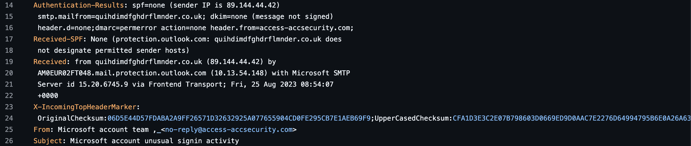
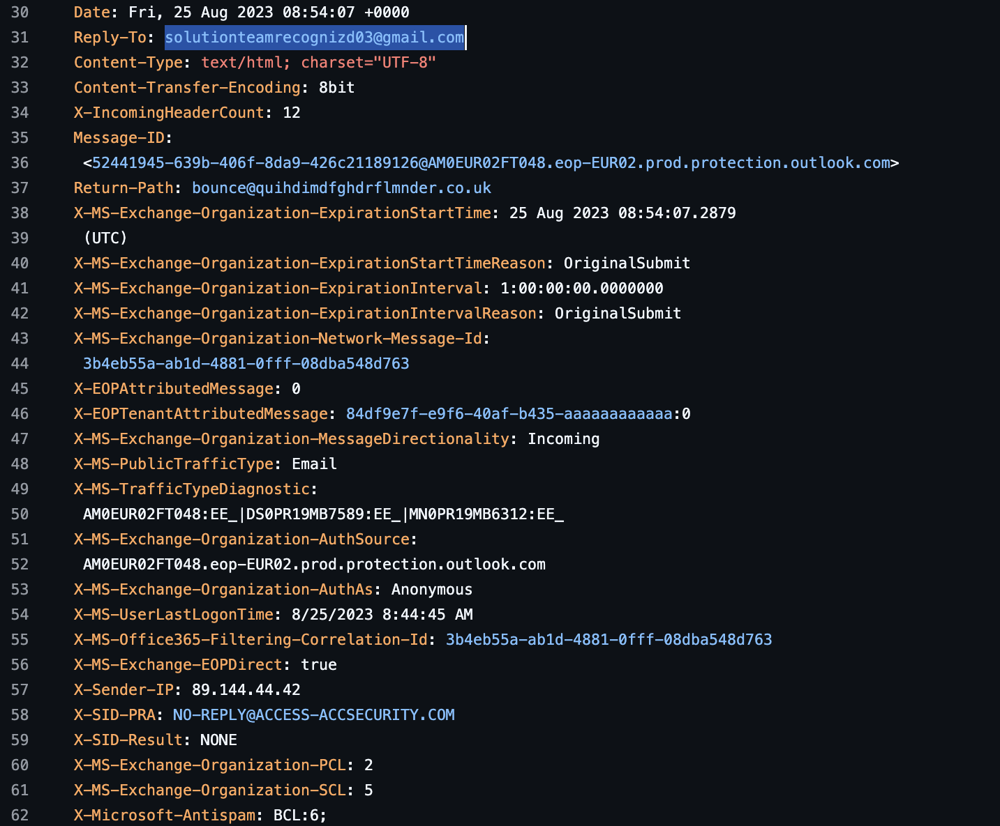
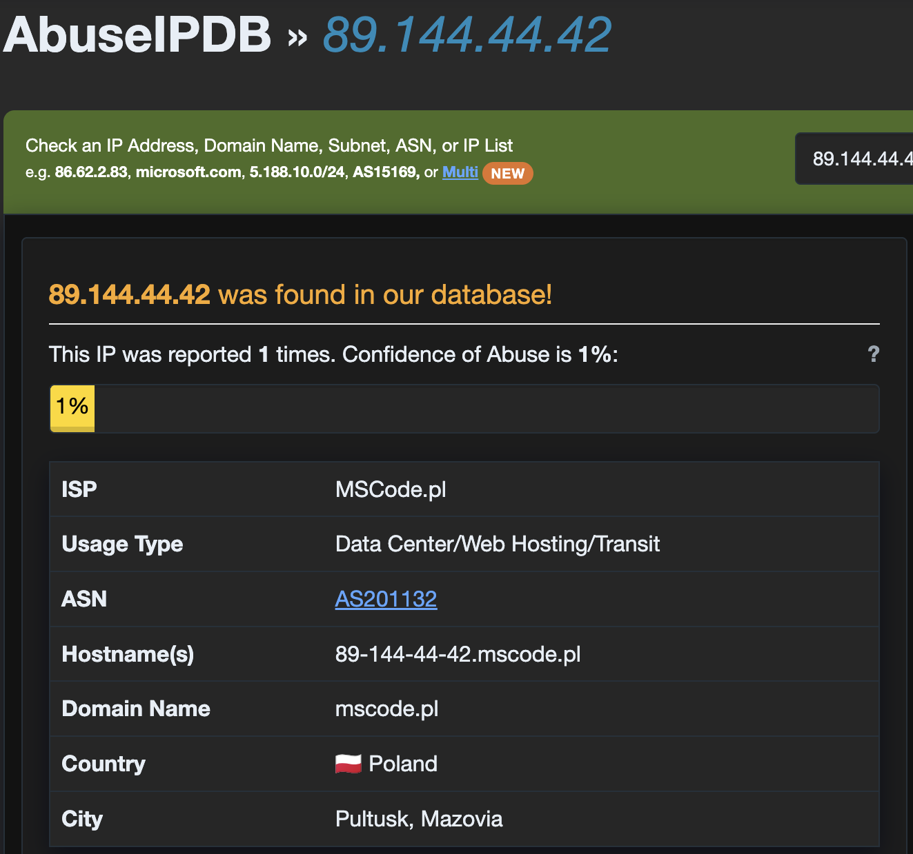
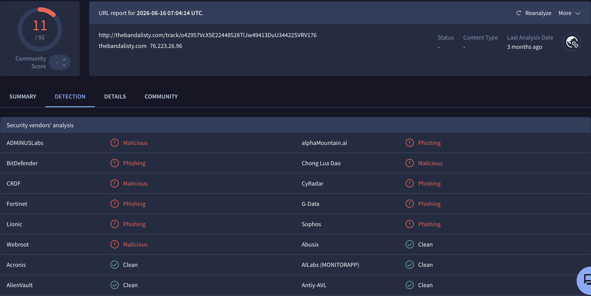

# Phishing Email Analysis — Sample 1167

| Field | Value |
|-------|-------|
| **Sample source** | [rf-peixoto/phishing_pot](https://github.com/rf-peixoto/phishing_pot) — `sample-1167.eml` |
| **Analyst** | Shodiyor Tuychivoyev |
| **Analysis date** | 30 September 2026 |
| **Verdict** | 🔴 **Phishing — Microsoft impersonation (reply-based scam) — High risk** |

> ⚠️ All malicious URLs, domains and email addresses in this report are **defanged** (`hxxp`, `[.]`, `[@]`) to prevent accidental clicks.

---

## 1. Summary

This email impersonates the **Microsoft account team** and warns the recipient about "unusual sign-in activity" on their Microsoft account — a classic fear-based lure.

The email was **not sent by Microsoft**: SPF and DKIM returned `none`, DMARC returned `permerror`, the visible sender uses a lookalike domain (`access-accsecurity.com`), the actual sending domain is a randomly generated string, and all replies are directed to a **free Gmail address**.

Unlike typical credential-phishing emails, this one contains **no link to a fake login page**. Instead, the "Report The User" button is a `mailto:` link that opens a new email addressed to the attacker's Gmail account. The goal is to make the victim **reply**, which confirms an active, responsive target for follow-up social engineering. The email also contains a hidden tracking pixel hosted on a domain flagged as phishing by 11 security vendors.

---

## 2. Email Details

| Field | Value |
|-------|-------|
| **From (display)** | Microsoft account team `<no-reply[@]access-accsecurity[.]com>` |
| **Reply-To** | `solutionteamrecognizd03[@]gmail[.]com` |
| **Return-Path** | `bounce[@]quihdimdfghdrflmnder[.]co[.]uk` |
| **Envelope sender (smtp.mailfrom)** | `quihdimdfghdrflmnder[.]co[.]uk` |
| **Subject** | Microsoft account unusual signin activity |
| **Date** | Fri, 25 Aug 2023 08:54:07 UTC |
| **Sender IP** | `89.144.44[.]42` |
| **Sender hostname (HELO)** | `quihdimdfghdrflmnder[.]co[.]uk` |
| **Message-ID** | Assigned by Microsoft's receiving server (`...@AM0EUR02FT048.eop-EUR02.prod.protection.outlook.com`), which suggests the original message was sent without its own Message-ID |
| **Priority flags** | `Importance: high`, `X-Priority: 1` |
| **Content** | `text/html`, `Content-Transfer-Encoding: 8bit` (not encoded, readable as plain text) |
| **Recipient** | Redacted by sample repository (`phishing@pot`) |

**Three different domains in one email:**

| Header | Domain | Role |
|--------|--------|------|
| `From` | `access-accsecurity.com` | What the victim sees |
| `Return-Path` / `smtp.mailfrom` | `quihdimdfghdrflmnder.co.uk` | Actual sending domain (bounces go here) |
| `Reply-To` | `gmail.com` | Where the victim's reply goes — the attacker |

---

## 3. Header Analysis

**Authentication results:**

```
Authentication-Results: spf=none (sender IP is 89.144.44.42)
 smtp.mailfrom=quihdimdfghdrflmnder.co.uk; dkim=none (message not signed)
 header.d=none;dmarc=permerror action=none header.from=access-accsecurity.com;
Received-SPF: None (protection.outlook.com: quihdimdfghdrflmnder.co.uk does
 not designate permitted sender hosts)
```

| Check | Result | Meaning |
|-------|--------|---------|
| **SPF** | ⚠️ None | The sending domain `quihdimdfghdrflmnder.co.uk` has no SPF record, so the sending server cannot be verified. |
| **DKIM** | ❌ None | The message is not digitally signed. Genuine Microsoft security emails are always DKIM-signed. |
| **DMARC** | ❌ PermError | The DMARC record of `access-accsecurity.com` is missing or misconfigured, so DMARC could not be evaluated. A real Microsoft domain would have a valid, strict DMARC policy. |

**Key findings:**

- **Lookalike domain.** Genuine Microsoft account security notifications are sent from `accountprotection.microsoft.com`. The domain `access-accsecurity.com` is not owned by Microsoft; it only uses security-related words to look official.
- **Domain misalignment.** The visible From domain (`access-accsecurity.com`) and the real sending domain (`quihdimdfghdrflmnder.co.uk`) are completely unrelated.
- **Free webmail Reply-To.** Replies go to `solutionteamrecognizd03@gmail.com`. Microsoft never asks users to reply to a Gmail address about account security. The address also contains a spelling mistake ("recogniz**d**").
- **Randomly generated sending domain.** `quihdimdfghdrflmnder.co.uk` is a meaningless string, typical of throwaway spam infrastructure.
- **Microsoft's own filter flagged it.** `X-MS-Exchange-Organization-SCL: 5` means Microsoft's spam confidence level rated the email as **spam** (SCL 5–6).
- **Artificial urgency.** `Importance: high` and `X-Priority: 1` mark the email as urgent in the victim's inbox.





---

## 4. IP Reputation — `89.144.44[.]42`

| Source | Result |
|--------|--------|
| **VirusTotal** | 0/91 — no vendor flagged the IP. Network `89.144.44.0/24`, AS201132 (MSCode), Poland |
| **AbuseIPDB** | 1 report, 1% confidence of abuse |
| **ISP** | MSCode.pl |
| **Usage type** | Data Center / Web Hosting / Transit |
| **Hostname** | `89-144-44-42.mscode.pl` |
| **Location** | Pułtusk, Mazovia, Poland |

VirusTotal and AbuseIPDB agree on the owner and location of the IP.

**Note on the AbuseIPDB report:** the single report (categorized as brute-force, related to a firewall scan on TCP port 8000) was submitted in **2026**, about **three years after** this email was sent. Hosting IPs change hands over time, so this report cannot be directly linked to the phishing campaign.

**Conclusion:** IP reputation alone is inconclusive. However, a Microsoft security email would never originate from a small third-party hosting provider in Poland. Combined with the authentication results, the sending infrastructure is considered **suspicious**.



---

## 5. URL & Link Analysis

The HTML body is not encoded (`8bit`), so it was searched directly for `href`, `http` and `mailto`.

### 5.1 `mailto:` link — the main attack vector

```html
<a href="mailto:solutionteamrecognizd03@gmail.com?&cc=solutionteamrecognizd03@gmail.com&Subject=Report+The+User">
```

The "Report The User" call to action does not open a website. It opens a new email in the victim's mail client, pre-filled with:

- **To:** `solutionteamrecognizd03[@]gmail[.]com`
- **CC:** the same Gmail address
- **Subject:** "Report The User"

A worried victim who clicks it and presses Send confirms to the attacker that their email address is **active and that they react to security alerts**. The attacker can then continue the conversation, for example by asking for verification codes, passwords or remote access. This technique also helps the email bypass URL-based security filters, because there is no malicious web link to scan.

### 5.2 Tracking pixel

```html

```

| Field | Value |
|-------|-------|
| **URL** | `hxxp://thebandalisty[.]com/track/o42957VcXSE22448528TlJw49413DuU34422SVRV176` |
| **Purpose** | Invisible 1×1 px image; tells the attacker when the email is opened |
| **Domain IP** | `76.223.26[.]96` |
| **VirusTotal** | **11/92** vendors flagged the URL |
| **Phishing** | alphaMountain.ai, BitDefender, CyRadar, Fortinet, G-Data, Lionic, Sophos |
| **Malicious** | ADMINUSLabs, Chong Lua Dao, CRDF, Webroot |
| **Categories** | Sophos: phishing and fraud · Webroot: Phishing and Other Frauds · BitDefender: **parked** |
| **First seen on VirusTotal** | 14 January 2025 |

BitDefender currently categorizes the domain as **parked**, which suggests the campaign has ended and the domain has been abandoned or is no longer actively hosting content.



---

## 6. Phishing Techniques Observed

| Technique | Evidence |
|-----------|----------|
| **Brand impersonation** | Display name "Microsoft account team" with a non-Microsoft domain |
| **Lookalike domain** | `access-accsecurity.com` imitates official security wording |
| **Fear / urgency** | "Unusual sign-in activity" subject, high-priority flags |
| **Reply-based social engineering** | `mailto:` "Report The User" button sends the victim's reply to the attacker's Gmail |
| **Free webmail abuse** | Attacker uses a Gmail account instead of hosting their own infrastructure |
| **Filter evasion** | No clickable malicious URL — only a `mailto:` link, which URL scanners do not analyze |
| **Tracking pixel** | Hidden 1×1 px image confirms the email was opened |
| **Unencrypted HTTP** | Tracking URL uses `http://`, unusual for legitimate services |
| **Throwaway infrastructure** | Randomly named sending domain, third-party hosting IP |

**MITRE ATT&CK mapping:**

| ID | Technique | Relevance |
|----|-----------|-----------|
| T1566 | Phishing | Delivery of a deceptive email impersonating Microsoft |
| T1598 | Phishing for Information | The `mailto:` reply lure is designed to collect a response and information from the victim |

---

## 7. Indicators of Compromise (IOCs)

| Type | Value | Verdict |
|------|-------|---------|
| Email | `no-reply[@]access-accsecurity[.]com` | Malicious — spoofed sender |
| Email | `solutionteamrecognizd03[@]gmail[.]com` | **Malicious** — attacker Reply-To / mailto target |
| Email | `bounce[@]quihdimdfghdrflmnder[.]co[.]uk` | Suspicious — Return-Path |
| Domain | `access-accsecurity[.]com` | Malicious — Microsoft lookalike |
| Domain | `quihdimdfghdrflmnder[.]co[.]uk` | Suspicious — random sending domain |
| Domain | `thebandalisty[.]com` | **Malicious** — tracking domain (VirusTotal 11/92) |
| URL | `hxxp://thebandalisty[.]com/track/o42957VcXSE22448528TlJw49413DuU34422SVRV176` | **Malicious** — tracking pixel |
| IPv4 | `89.144.44[.]42` | Suspicious — sending server, no direct reputation hits |
| IPv4 | `76.223.26[.]96` | Informational — current resolution of the tracking domain (likely shared infrastructure, do not block) |

---

## 8. Verdict

| | |
|---|---|
| **Classification** | Phishing — Microsoft impersonation, reply-based social engineering |
| **Risk level** | 🔴 High |
| **Confidence** | High |

**Reasoning:** the email impersonates Microsoft from a lookalike domain, fails sender authentication (SPF none, DKIM none, DMARC permerror), was sent from randomly named third-party infrastructure, redirects all replies to a free Gmail account, uses a `mailto:` lure to collect responses, and contains a tracking pixel on a domain flagged by 11 security vendors. Microsoft's own filter also rated it as spam (SCL 5).

---

## 9. Recommendations

1. **Block IOCs** — add `access-accsecurity.com`, `quihdimdfghdrflmnder.co.uk` and `thebandalisty.com` to the email gateway and web proxy blocklists; block the sender IP `89.144.44.42` on the email gateway.
2. **Block the attacker's mailbox** — create a rule that blocks **outgoing** emails to `solutionteamrecognizd03@gmail.com`, so no employee can reply.
3. **Search & Purge** — find and remove all emails with the same sender, Reply-To or subject from user mailboxes.
4. **Check outbound mail logs** — this is the most important step for this campaign: search for any emails **sent from** the organization to the Gmail address. Any user who replied should be contacted immediately.
5. **Respond to affected users** — if a user replied or shared information, reset their credentials, revoke active sessions, review MFA settings and open an incident ticket.
6. **Report abuse** — report the Gmail address to Google so the account can be suspended.
7. **Improve detection** — flag or quarantine emails where the display name contains a well-known brand (e.g. "Microsoft") but the sending domain is not the brand's official domain, and emails where the Reply-To is a free webmail provider while the From address is not.
8. **User awareness** — remind users that Microsoft security alerts never ask them to reply by email; account activity should always be checked directly at `account.microsoft.com`.

---

## 10. Tools Used

- **GitHub Raw view** — reading email headers and HTML body
- **VirusTotal** — IP, domain and URL reputation
- **AbuseIPDB** — IP abuse reports and ISP information
- **Browser search (Ctrl/Cmd + F)** — extracting `href`, `http` and `mailto` links from the raw email
